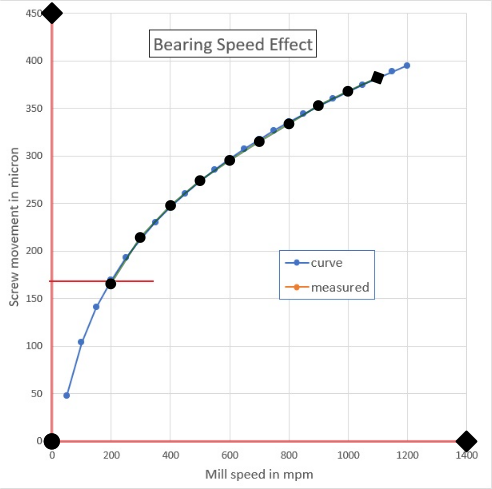

<!-- markdownlint-configure-file { "MD013": {
    "line_length": 100,
    "heading_line_length": 100,
    "code_block_line_length": 1000
} } -->

# Unplot

!!! note "Version history"

    This feature was added to StepUp RepRep 1.4.

Unplot converts plots back into data points.
(It is a sanitized version of [Depix](https://github.com/tovrstra/depix).)

## How to prepare an input SVG file

1. If the plot is embedded in a PDF, use `pdfimages`
   to extract the figures from the PDF as PBM files.
   Most PDF viewers can easily extract bitmaps from a PDF:
   right-click on the image and select "Save Image As ...".

2. Open the image containing the plot in Gimp,
   crop it if necessary, and save it as a PNG or JPEG file.

3. Open the PNG or JPG file in Inkscape.
   Use the "link" option to avoid large SVG files in one of the following steps.

4. Draw the x-axis and y-axis as two separate straight line segments,
   i.e., lines with only one start node and one end node.
   The accuracy of the extracted data will improve
   if these line segments are made as long as possible.
   It also helps to zoom in to place the nodes as accurately as possible.
   You must make sure that the start and the end nodes are at well-defined points on the axes.
   Unplot can handle cases where the x and y axes are not orthogonal or are rotated,
   e.g. due to a bad scan.

5. Draw one or more polylines consisting of straight line segments
   over the curve(s) of interest.
   Make sure that your drawing falls nicely over the curve in the scanned image,
   as this will also determine the accuracy of the final data.
   It may be helpful to use a brightly colored and semi-transparent line style.
   Inkscape also supports node markers that make it easier to position the nodes,
   as shown in the example below.
   Zooming in on the data points also helps to optimize their position.

6. Open the XML Editor in Inkscape. (Press `Ctrl-Shift-X`.)
   Add attributes to the new paths you've drawn needed to interpret them correctly:

    - Select the x-axis in the figure and add the following attributes:
        - `axis`: your name of the axis
        - `low`: numerical value corresponding to the start the path
        - `high`: numerical value corresponding to the end the path
        - `scal`: `linear` or `log`
        - `unit`: the unit of the axis
    - Select the y-axis in the figure and add the same attributes for the second axis.
    - The paths over the curves should be given a `data` attribute whose value is
      is a label to identify the data series in the output.

7. In the menu, select "File" ➔ "Save As..." to save the file in SVG format.

## Example

Example source files: [advanced_topics/unplot/](https://github.com/reproducible-reporting/stepup-reprep/tree/main/docs/advanced_topics/unplot)

The following plot has been [taken from Wikipedia](https://en.m.wikipedia.org/wiki/File:Measured_Bearing_Speed_Effect_data_and_curve.jpg)
and the necessary paths have been drawn over it as input for Unplot.
Open this file in Inkscape to inspect the paths in the XML Editor.
You will find the following (among other attributes):

```xml
<path
    d="M 51.564216,441.96145 51.70753,13.139368"
    id="path2"
    low="0"
    unit="micron"
    high="450"
    scale="linear"
    axis="screw movement" />
<path
    d="m 51.564216,441.96145 415.207694,0.0146"
    id="path3"
    axis="mill speed"
    unit="mpm"
    low="0"
    high="1400"
    scale="linear" />
<path
    d="m 110.57991,284.1976 29.46788,-46.38471 30.43143,-32.0766 29.46052,-24.88177 29.73658,-20.27491 29.64224,-18.83789 29.69832,-17.71775 29.42497,-18.3225 29.57262,-14.312601 29.64572,-13.618158"
    id="path8"
    data="measured" />
```

The `d` attribute encode the node positions of the paths and should not be changed in the XML editor.
All other attributes were added manually in the XML editor by following the instructions above.

As shown in the figure below,
the start and intermediate nodes are marked with circles.
The end node is a diamond.
Hollow node markers can be easily aligned with data points in the original image.



To convert these paths into data, you can use the `unplot` function of StepUp RepRep as follows:

```python

```

To run the example, make the scripts executable and run StepUp:

```bash
chmod +x plan.py tile.py
stepup -n -w1
```

You should see the following terminal output:

```text

```

The output is a JSON file containing the extracted data points:

```json

```

Each curve is an item in the dictionary
and the corresponding value is a list with two lists (x- and y-coordinates).

## Tips and tricks

**Q.**
The data points are flipped horizontally or vertically. How can I fix this?

> **A.**
> You need to make sure that the order of the two points in the line segments for the x
> (or y) axes is compatible with the `low` and `high` attributes.
> Add a special end marker in Inkscape to identify the end point of the line segment.
> The menu item "Path" ➔ "Reverse" allows you to swap start and end.

**Q.**
How can I extract error bars from plots?

> **A.**
> Draw two polylines, one for each end of the error bar,
> and ensure they have the same number of nodes in the same order.
> When loading the JSON file created by unplot,
> you need to post-process the two paths.
> For example, for vertical error bars,
> average their x-coordinates and compute the difference of their y-coordinates.
