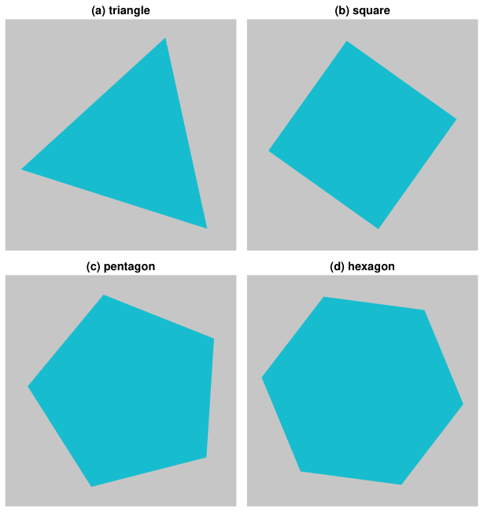

# Tiling PDFs

StepUp RepRep contains a tool to tile panels (individual PDF figures) into one composite PDF figure.

The tiling code builds on the script protocol in StepUp Core,
which is explained in the [Getting Started tutorials](https://reproducible-reporting.github.io/stepup-core/getting_started/introduction/) of StepUp Core.

This tutorial provides a simple example, which you can use as a starting point.
For a more advanced example, check out the [`tild_pdf` test case](https://github.com/reproducible-reporting/stepup-reprep/tree/main/tests/cases/tile_pdf) in the unit test suite of StepUp RepRep.


## Example

Example source files: [tutorials/tiling_pdfs/](https://github.com/reproducible-reporting/stepup-reprep/tree/main/docs/tutorials/tiling_pdfs)

Create a `tile.py` script with the following code:

```python

```

Next, create a script `plan.py` as follows:

```python

```

For this example to work, you also need to create four SVG figures of the same size: `triangle.svg`, `square.svg`, `pentagon.svg` and  `hexagon.svg`.

To run the example, make the scripts executable and run StepUp:

```bash
chmod +x plan.py tile.py
stepup -n -w1
```

You should see the following terminal output:

```

```

This is the PNG conversion of the resulting PDF figure:


